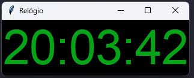

# ⏰ Relógio Digital com Tkinter

## 📌 Descrição
Este projeto é um **relógio digital simples** feito com **Python** e **Tkinter**.  
Ele mostra a hora atual em tempo real e atualiza a cada segundo.

> ⚠️ Observação: este projeto roda **localmente** na sua máquina.

---

## 🚀 Tecnologias utilizadas
- Python  
- Tkinter  

---

## 🖼️ Screenshot da aplicação

> A imagem mostra a aplicação rodando no seu computador.

---

## ▶️ Como executar o projeto

1. Clone o repositório:
bash
git clone https://github.com/seuusuario/relogio-tkinter.git

2. Entre na pasta do projeto:
cd relogio-tkinter

3. Execute o relógio:
python relogio.py

⚠️ A aplicação vai abrir uma janela com o relógio digital em tempo real.

🎯 Objetivo

Este projeto foi criado para praticar interfaces gráficas com Python e Tkinter, exibindo a hora em tempo real de forma simples.
   
